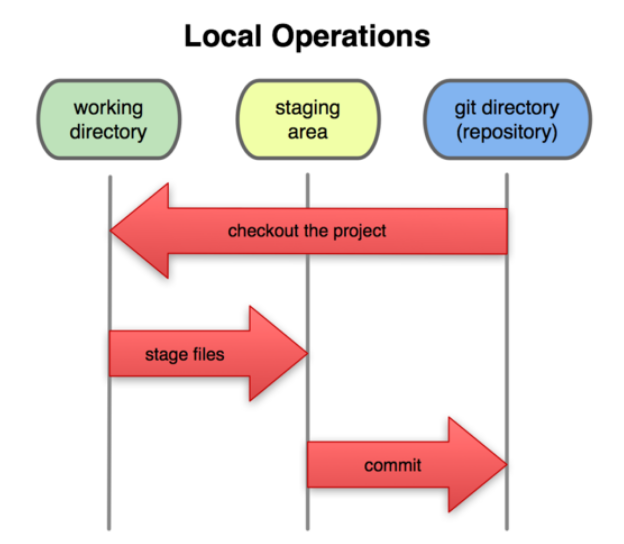

# Introducción

## Git

Sistema para el control distribuido de versiones de código. Fundamentalmente permite:

* Dar seguimiento a los cambios realizados sobre un archivo.
* Almacenar una copia de los cambios.

## GitHub

Sitio web donde podemos subir una copia de nuestro repositorio Git.

# Ventajas

## Git

* Habilidad de deshacer cambios.
* Historial y documentación de cambios.
* Múltiples versiones de código.
* Habilidad de resolver conflictos entre versiones de dsitintos programadores.
* Copias independientes.

## GitHub

* Documentación de requerimientos.
* Ver el avance del desarrollo.

# Instalación

* Para instalar Git: https//git-scm.com
* En el curso se utilizará Git a través de líneas de comandos.
* Para eclipse existen *plugins* integrados: https://www.eclipse.org/egit

# Configuración básica

Nombre del administrador:

	git config --global user.name "José Antonio Delgado Rodríguez"

Correo electrónico:

	git config --global user.email i12deroj@uco.es

Editor de texto:

	git config --global core.editor "gedit"

Color de la interfaz:

	git config --global color.ui true

Listado de la configuración:

	git config --list

# Los tres estados de git

