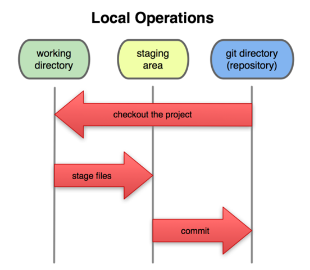

# Introducción

## Git

Sistema para el control distribuido de versiones de código. Fundamentalmente permite:

* Dar seguimiento a los cambios realizados sobre un archivo.
* Almacenar una copia de los cambios.

## GitHub

Sitio web donde podemos subir una copia de nuestro repositorio Git.

# Ventajas

## Git

* Habilidad de deshacer cambios.
* Historial y documentación de cambios.
* Múltiples versiones de código.
* Habilidad de resolver conflictos entre versiones de dsitintos programadores.
* Copias independientes.

## GitHub

* Documentación de requerimientos.
* Ver el avance del desarrollo.

# Instalación

* Para instalar Git: https//git-scm.com
* En el curso se utilizará Git a través de líneas de comandos.
* Para eclipse existen *plugins* integrados: https://www.eclipse.org/egit

# Configuración básica

Nombre del administrador:

	git config --global user.name "José Antonio Delgado Rodríguez"

Correo electrónico:

	git config --global user.email i12deroj@uco.es

Editor de texto:

	git config --global core.editor "gedit"

Color de la interfaz:

	git config --global color.ui true

Listado de la configuración:

	git config --list

# Los tres estados de git

# Comandos básicos

Iniciar repositorio en un directorio:

	git init

Agregar cambios al área de *staging*:

	git add

Validar cambios en el repositorio:

	git commit -m "Mensaje"

Hacer los dos pasos anteriores en uno:

	git commit -am "Mensaje"

Historial de commits:

	git log

Ayuda del listado anterior:

	git help log

Listar los commits más recientes:

	git log -n 5

Listar los commits desde una fecha:

	git log --since=2018-09-18

Ver los cambios en el directorio:

	git status

Ver diferencia entre ficheros en el directorio y en el repositorio de git:

	git diff

Ver diferencia entre ficheros en el *staging* y el repositorio:

	git diff --staged

Eliminar archivos:

	git rm archivo
	git commit -m "Mensaje"

Mover o renombrar archivos:

	git mv antiguo nuevo
	git commit -m "Mensaje"

Deshacer cambios con git:

	git checkout -- nombre_fichero

Retirar archivos del *staging*:

	git reset HEAD nombre-fichero

Complementar último commit:

	git commit --amend -m "mensaje"

Recuperar version de un fichero de commit antiguo:

	git checkout <id_commit> -- nombre_archivo

Revertir un commit:

	git revert <id_commit>

Deshacer multiples cambios en el repositorio:

	git reset --soft <id_commit>
	git reset --mixed <id_commit>
	git reset --hard <id_commit>

Listar archivos que git no controla:

	git clean -n

Eliminar archivos que git no controla:

	git clean -f

Ignorar archivos en el repositorio:

	.gitignore

Listar el contenido del repositorio de git:

	git ls-tree master
	git ls-tree master^^^
	git ls-tree master~3

Log en una linea:

	git log --oneline

Log con los tres últimos commits en una línea:

	git log --oneline -3

Examinar el contenido de un commit: 

	git show <id>

Comparar un commit con el actual:

	git diff <id> nombre_archivo

Comparar dos commits:

	git diff id..id nombre_archivo

