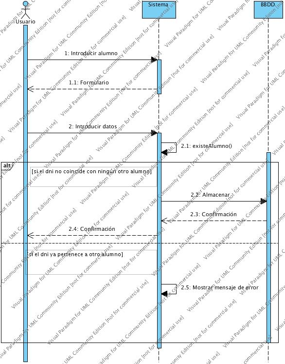
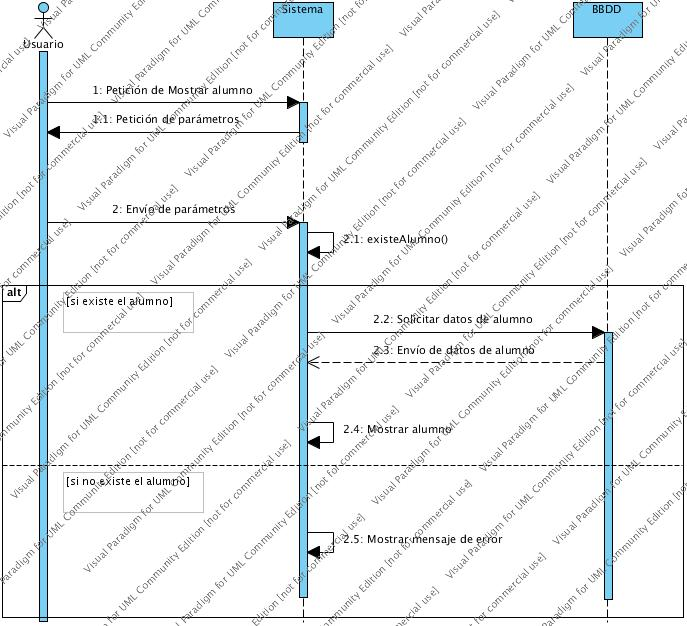
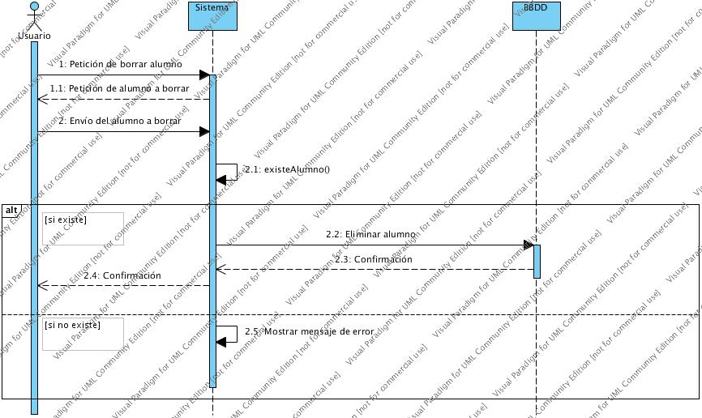
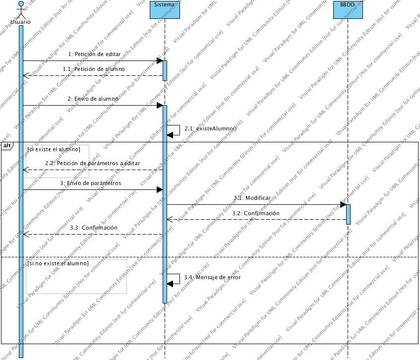
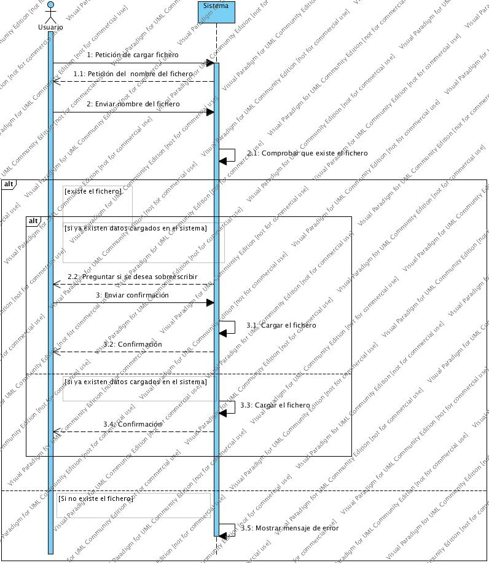
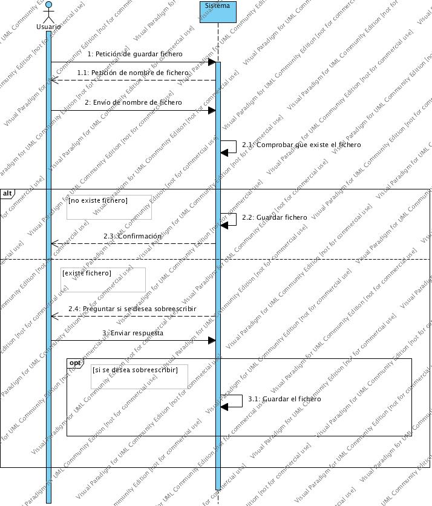
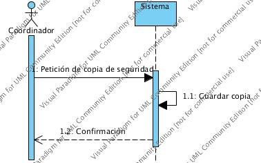

## Diagrama de clase

Nuestro diagrama cuenta con 5 clases: profesor, alumno, listaAlumnos, grupo y listaGrupos.

Las funciones simples, como constructores y modificadores, pertenecen a las clases alumno y grupo, mientras que las que modifican el conjunto, como añadir o borrar alumno, pertenecen a las clases listaAlumnos y listaGrupo.

Las clases grupo y listaGrupo tienen como propósito llevar un control sobre los líderes de cada grupo, así como facilitar la tarea de mostrar a los alumnos de un grupo concreto.

La clase profesor existe con el propósito de diferenciar a los profesores según sean coordinadores o ayudantes.

## Diagrama de secuencia

Se han realizado un total de 9 diagramas de secuencia, correspondientes a las principales funcionalidades del programa. Se han tenido en cuenta los flujos alternativos correspondientes a comprobaciones, permisos, privilegios, etc. 

